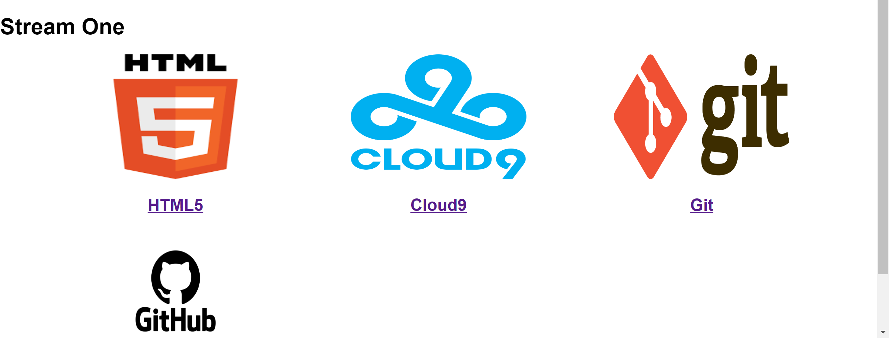

# My very first website

 Welcome to my very first website!
 
This website was build as part of the learning material for code institute's Fullstack Web Developer Program.
You can check the website [here](https://github.com/Adeniyi-Ol/my-practice-space?tab=readme-ov-file#gitpod-reminders).

## Project description
This website was built up to get familiar with the essential technologies as part of the learning material for code institute's Fullstack Web Developer Program.

## Technolgy used
HTML and CSS have been used to write up this website.

## Credits
As part of the learning process in becoming a Fullstack Developer, reference has been made on how to create a website in LMP and being pushed to github.

